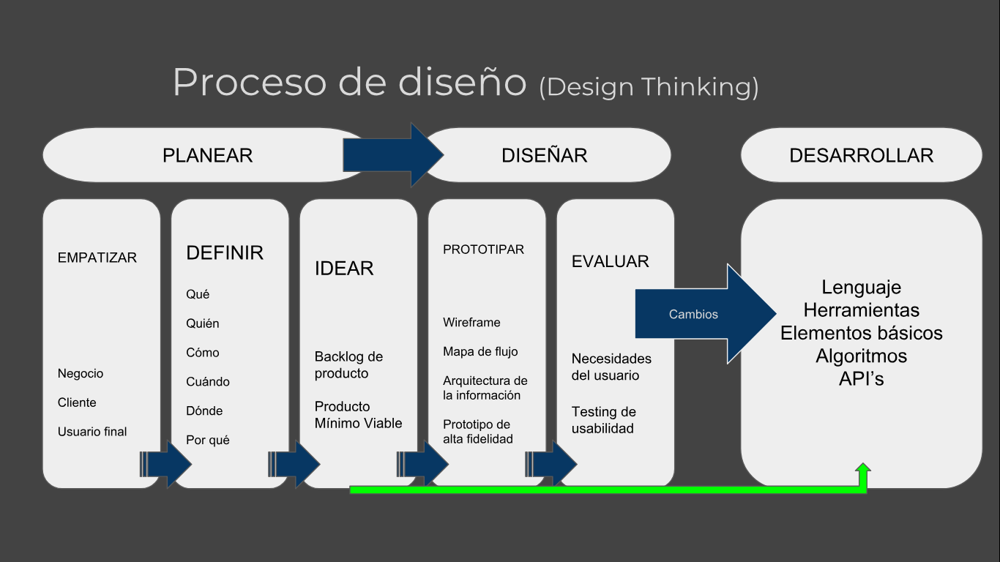
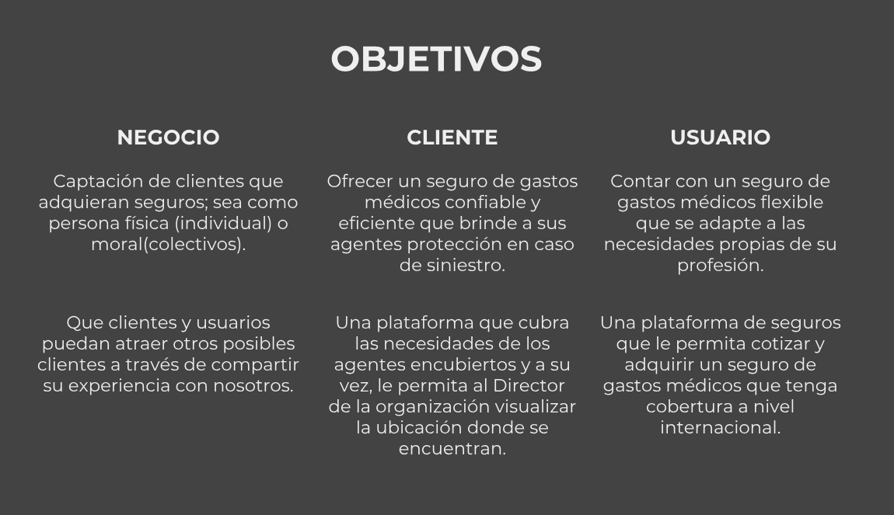
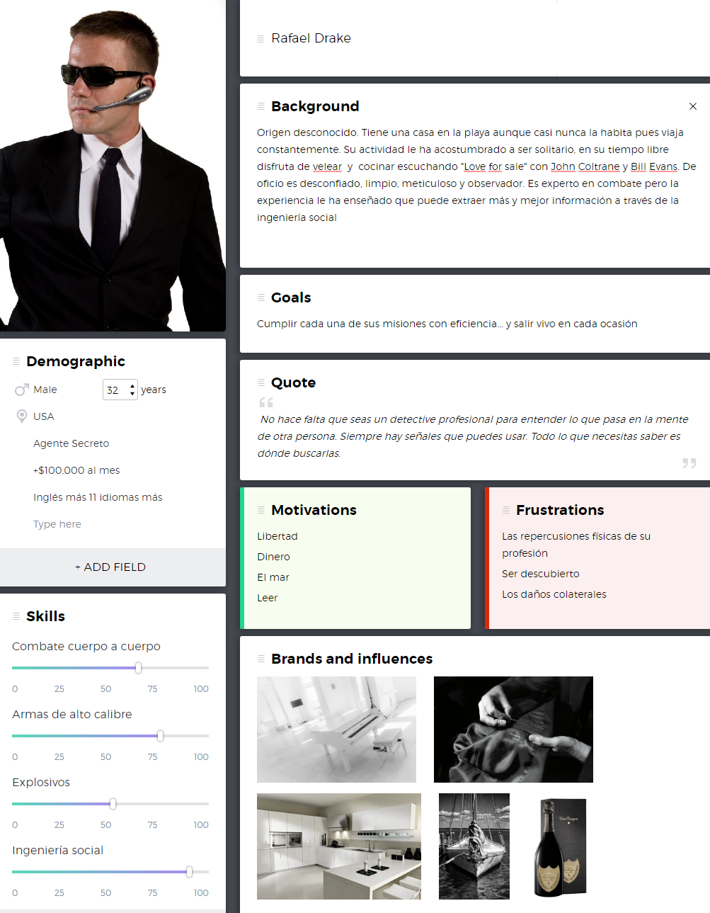
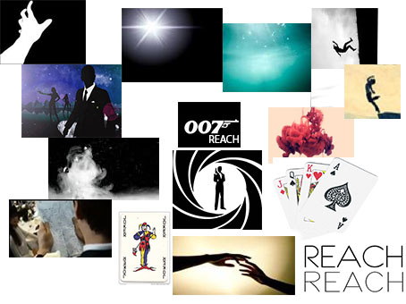
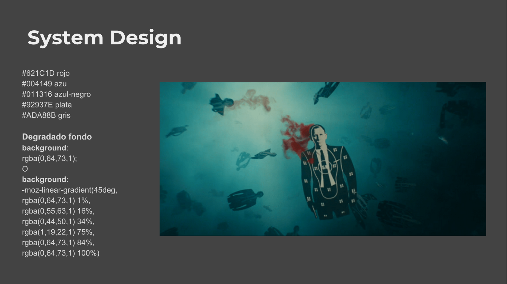

# SAFEGUARD
## Desarrollado para [AXA Seguros](https://axa.mx/home)

Reto de Axa para el Talent Fest de Laboratoria.
Aplicación móvil de Gastos Médicos exclusiva para Agentes Encubiertos.

## El Equipo

* Elizabeth Guerrero Torres (Fullstack Develpoper)
* Bethsabet Monserrat González Díaz (React Developer)
* Karina Quezada (UI Designer)
* Dení Morales Castelán (UX Researcher)

## El Reto

Originalmente el reto que se nos presentó consistía en desarrollar en 36 horas un producto de "fantasía": una webapp de microseguros para súperhéroes. Sorprendentemente encontramos que un producto como el que se nos planteó en el reto puede ser bastante viable en la realidad para agencias dedicadas al  espionaje y las operaciones encubiertas. 

El reto terminó redefiniéndose y acordamos desarrollar una aplicación móvil mediante la cual un agente encubierto pueda cotizar su Seguro de Gastos Médicos (SGM) en la modalidad de microseguro.

## Proceso

Por el tiempo limitado, desarrollo y diseño trabajamos en diferentes etapas al mismo tiempo.

Estrategia de trabajo

* Elegir el lenguaje de programación 
* Determinar las herramientas que necesitaremos
* Algoritmos
* API’s > Documentación
* Elementos desconocidos 
* Investigación/documentación

A través de el análisis de la información anterior y de los requerimientos establecidos por Axa definimos un backlog de producto para que las compañeras de desarrollo empezaran a trabajar.

Backlog de producto

* Sign in /Log in
* Cotizar - Adquirir
* Servicios
* Solicitar servicios

## Los objetivos

Nos encontramos con que teníamos que cubrir tres tipos de objetivos: nuestros propios objetivos (como Aseguradora Axa), los de nuestro cliente (la Agencia de Seguridad) y los de nuestro usuario final (espía o agente encubierto).

Insights:

* Una sola agencia puede llegar a gastar más de $100 millones anuales en sus operaciones encubiertas
* Un muestreo de esos trabajadores indicó que desde 2001 más de 1.100 ex empleados federales o actuales mencionaron trabajos encubiertos dentro de Estados Unidos
* Tan solo en ese país existen por lo menos 40 agencias dedicadas a la realización de operaciones encubiertas

[Fuente](https://www.clarin.com/mundo/mundo-sombras-agentes-encubiertos-EEUU-New-York-Times-segunda-parte_0_Skk7kld5vmx.html)

## Un usuario muy particular

Una de las grandes dificultades era adquirir información acerca de nuestros usuarios. Aunque se nos proporcionaron dos contactos anónimos, no era un número de usuarios suficientemente representativo. 

La manera de solucionarlo en pocas horas fue hacer investigación a través de reportajes y artículos periodísticos que nos aportaran una visión acerca del estilo de vida, riesgos, aspiraciones, deseos y necesidades de nuestro usuario.

* "(...)Más de la mitad de todo el trabajo se concentra en el comercio de sustancias ilegales. Lavado de dinero, bandas y el crimen organizado conforman el segundo gran grupo de operaciones."
[Fuente](https://www.clarin.com/mundo/mundo-sombras-agentes-encubiertos-EEUU-New-York-Times-segunda-parte_0_Skk7kld5vmx.html)

* "Se trataba de hombres y mujeres que a primera vista eran iguales a los estadounidenses promedio y que vivían vidas normales."
[Fuente](http://www.bbc.com/mundo/noticias-39071426)

* "Nuestro trabajo consiste en encontrar individuos que tengan acesso a secretos de inteligencia con valor para el Gobierno de Reino Unido. Mi trabajo es construir una relación entre estas personas, trabajando con ellos para obtener, de forma segura, los secretos a los que tienen acceso".
[Fuente](https://www.elconfidencial.com/alma-corazon-vida/2015-10-27/asi-son-los-espias-de-verdad-contado-por-agentes-en-activo-del-mi6_1072192/)

* “Ningún oficial actual o exoficial diría que escucha a Justin Bieber o Taylor Swift. Escuchan a Aerosmith, Coldplay y muchos artistas independientes”.
[Fuente](http://cnnespanol.cnn.com/2012/11/13/los-espias-de-la-vida-real-explican-sus-diferencias-con-james-bond/)

En las características del reto se nos presentó un perfil de usuario de ficción tipo superhéroe, sin embargo quisimos aterrizarlo un poco más a la realidad pero manteniendo este espíritu fantasioso y aventurero que se nos solicitó. De este modo migramos el perfil de superhéroe hacia un espía tipo James Bond.

## Diseño

Creamos la paleta de colores y un sencillo sistema de diseño basadas en una escena del intro de la película Tomorrow never Dies.

## Prototipo

* La característica básica principal es la calculadora para poder cotizar con base en los datos ingresados en el log in
* La ambulancia detectará automáticamente la ubicación del agente y el agente podrá ver el trayecto de ésta en su aplicación
* Se puede solicitar atención médica inmediata vía telefónica
* Del mismo modo se puede acceder a servicios de orientación psicológica
* La función SOS que envía automáticamente una imagen a la Agencia con el mensaje oculto "Fui descubierto"
* El Director de la Agencia podrá tener acceso a la ubicación de todos sus agentes por medio de esta aplicación

Se hizo una prueba remota del prototipo con los dos contactos anónimos que se nos proporcionaron para conocer su nivel de satisfacción general con el producto. 

* No tuvieron dificultades con el flujo
* Solicitaron servicio de ambulancia aérea
* Los servicios les parecieron adecuados
* El diseño y los colores gustaron mucho

## PMV

Nuestras compañeras de desarrollo se esforzaron muchísimo en poder replicar el prototipo y las funcionalidades que establecimos para el Producto Mínimo Viable.

[Ve aquí nuestro PMV](https://behtsa.github.io/axxa-challengue/)

